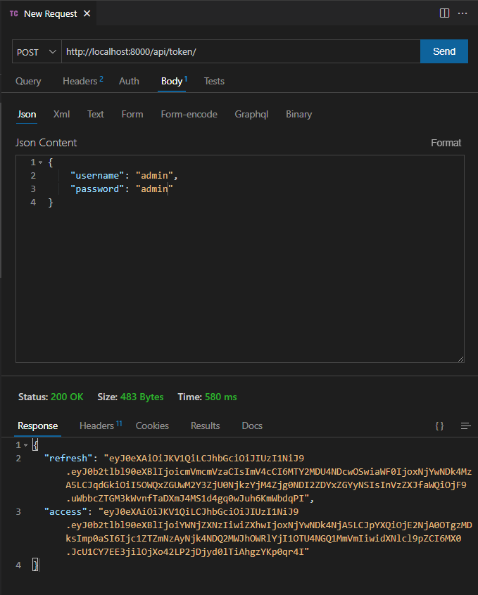
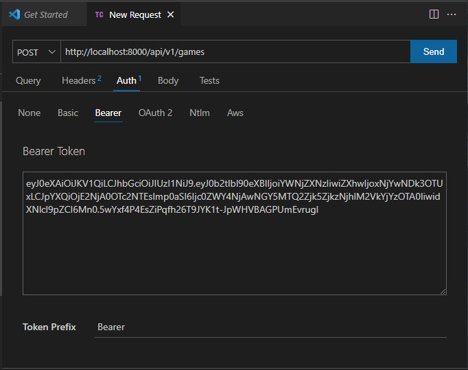
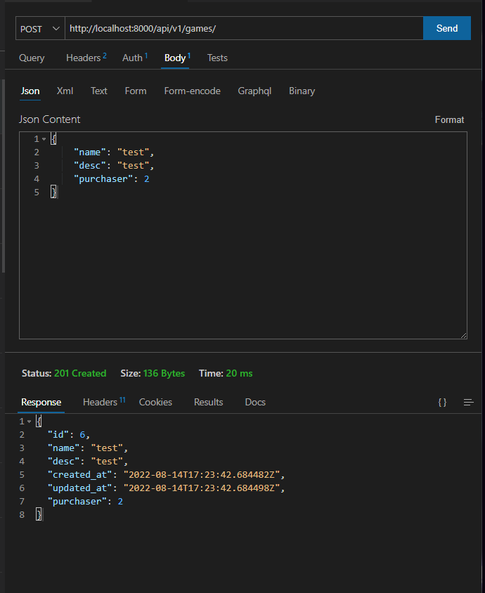
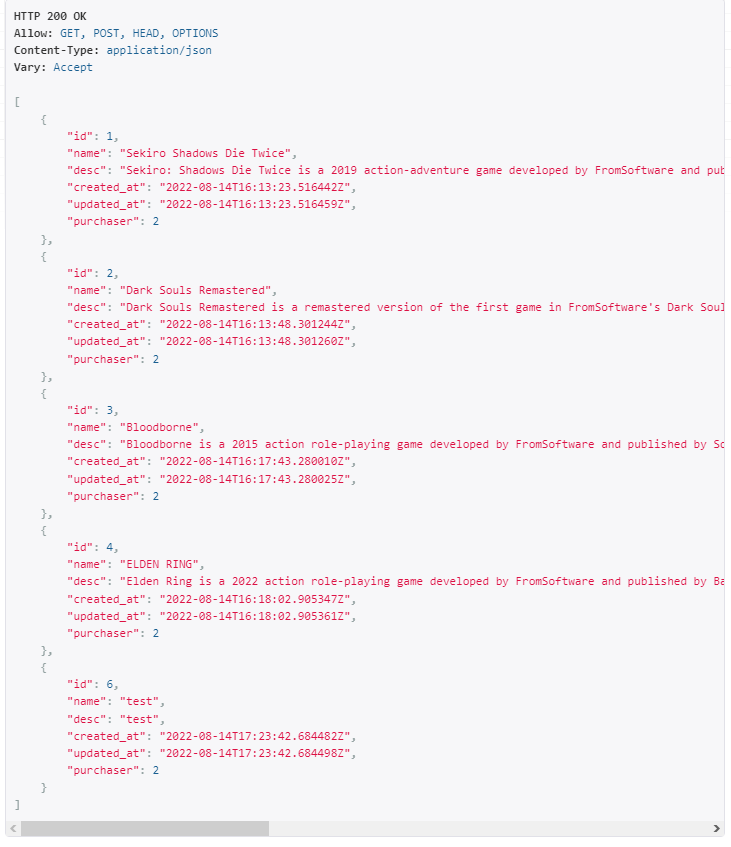
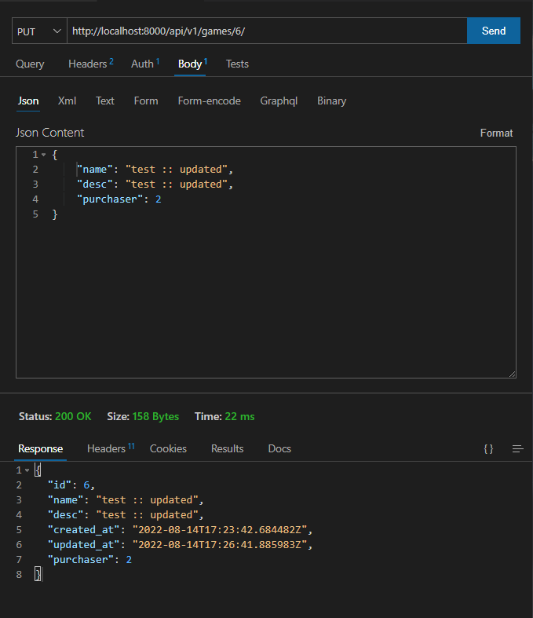
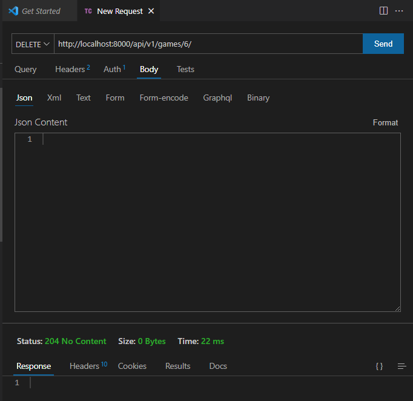
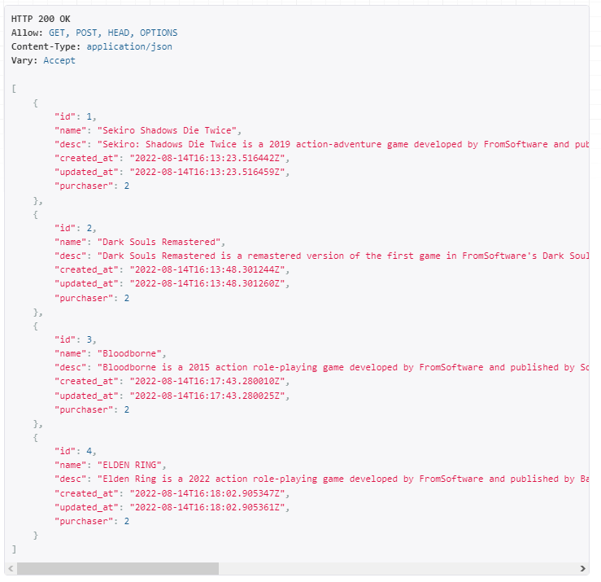
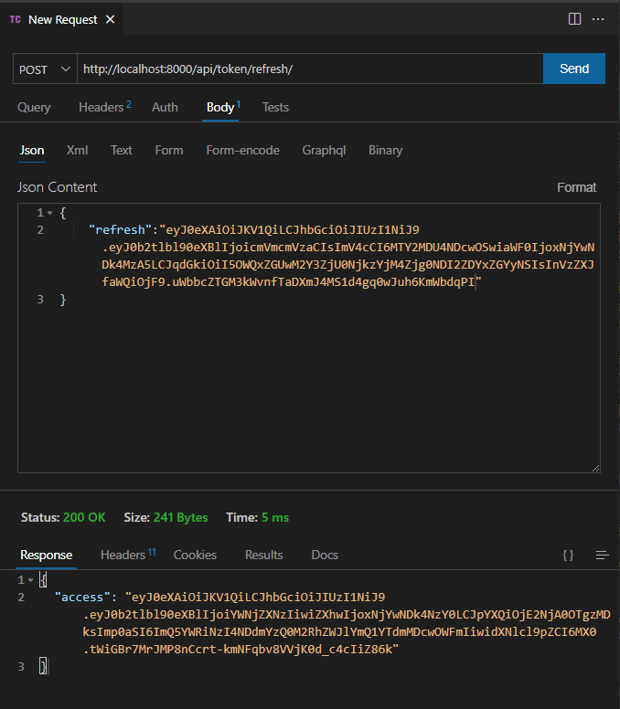

# LAB - Class 33

### Project: drf-auth

### Author: Mohammad Lebzo

### How to run:

In order to run the server enter "**docker-compose up**" then go to "**http://localhost:8000**" in browser.

In order to run the tests enter "**docker-compose run web python manage.py test**"

### Steps to manually test

in order to test, first you need to get an access token, by doing the following:

As you can see a `POST` request was sent to "**http://localhost:8000/api/token/**" with the 
username and password in the body, and the response contested of two key values, the first one is a refresh token, 
and the second is the access token we need.

After getting the access token we can now perform some actions, like posting data, so let's do that by first adding 
the access key:

And now let's perform the action:

The result:

There are some other actions that can be done after getting permission like updating and deleting: 

Delete Result:

After 5 mins of getting the access it will expire, and when that happen we need to use the refresh token 
at "**http://localhost:8000/api/token/refresh/**", so we can get a new access token:

**Note**: refresh tokens expire in 24 hours from creation time.
